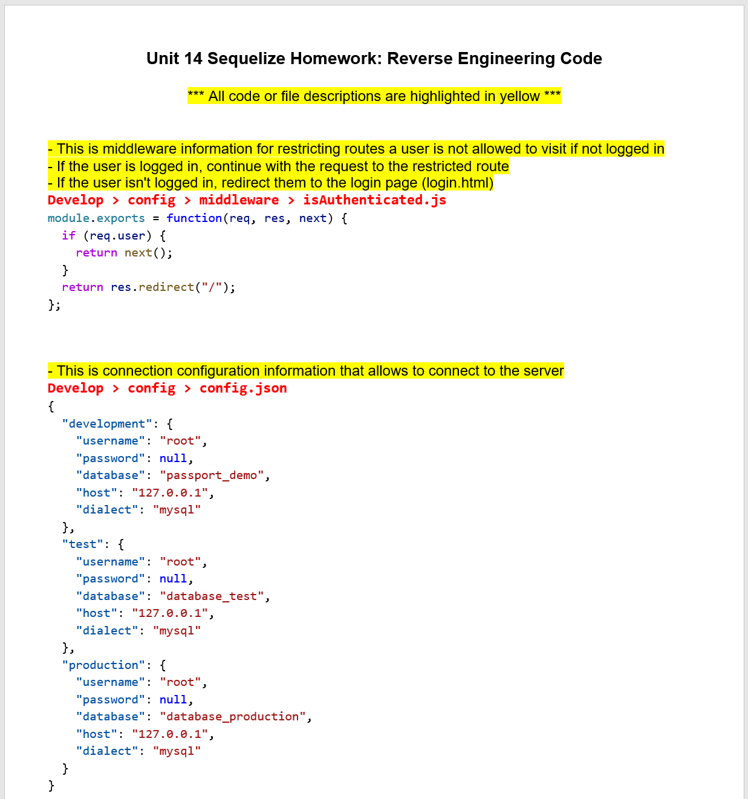
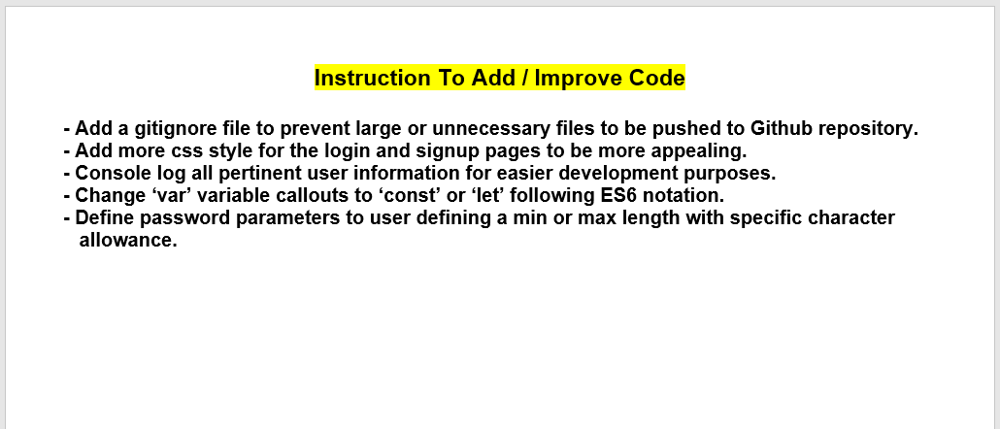

# 14-Reverse Engineering Code
___
## Objective
Reverse engineer the starter code provided and create a tutorial for the code.
___
## Table of Contents
* [User_Story](#user_story)
* [Installation](#installation)
* [Usage](#usage)
* [License](#license)
* [Contributing](#contributing)
* [Questions](#questions)
* [Application_Links_and_Images](#application_links_and_images)
## User_Story:
AS A developer   
I WANT a walk-through of the codebase   
SO THAT I can use it as a starting point for a new project 
___
## Installation
- No installation required.  The code files are for information purpose only.

- Refer to the Google Doc link below for File/Code descriptions, and Additional Instruction to add or make improvements.
   
_____
## Usage
When joining a new team, you will be expected to inspect a lot of code that you have never seen before. Rather than having a team member explain every line for you, you will dissect the code by yourself, saving any questions for a member of your team.
_____
## Contributing
ed-sivick, W3Schools, Stack Overflow, BCS Unit 14 class documentation
_____
## Questions
If there are any questions, or if you would prefer more information,
please contact the following person at their GitHub profile or email address below:

* [GitHub Profile](https://github.com/ed-sivick)
* ed@sivick.net
_____
## License
You can view more information concerning software licenses at the following link:

* [License](https://opensource.org/licenses/MIT)
_____
## Badges

___
## Application_Links_and_Images  
**Links:**  
[Google Doc - 14-Reverse Engineering Code.docx ](https://drive.google.com/file/d/16azY60e3d9nJ87t0xeBBLJ4bgbpN506V/view?usp=sharing)   

**Application Image Examples:** 

<strong>Image of Reverse Engineering Code Description</strong>

  
  
 
  
  
<strong>Image of Reverse Engineering Code Additional Instruction</strong>

  
  
 